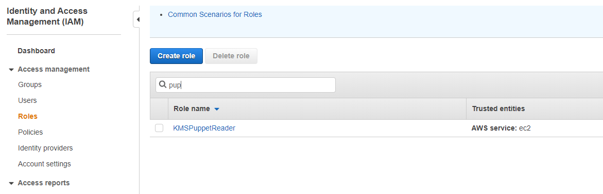
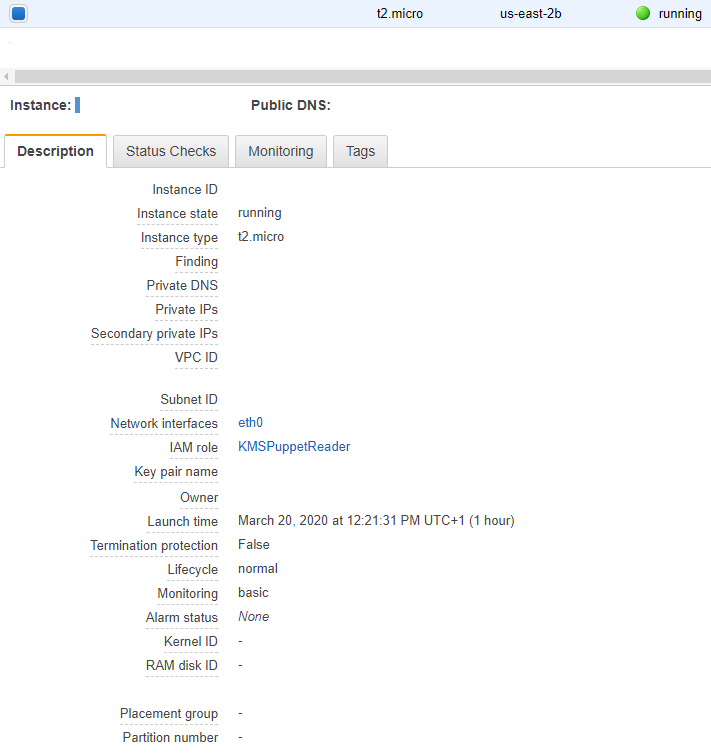
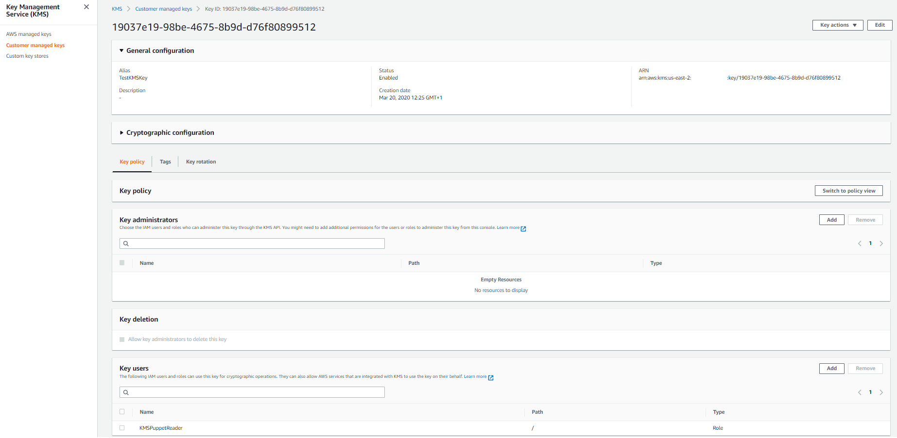
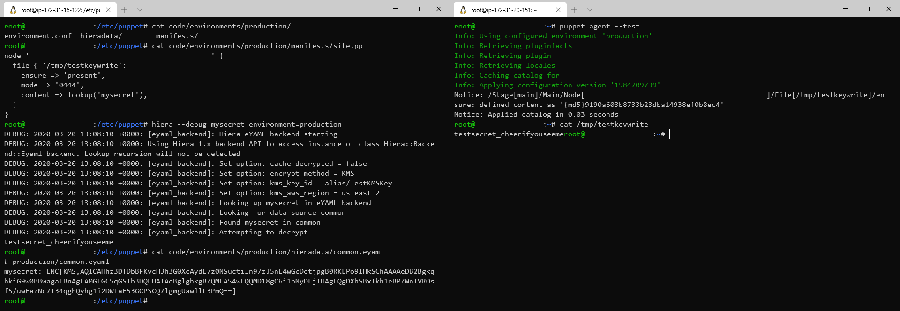

# Puppet stuff in EC2 without putting the plaintext secrets in GIT
> based on https://phalient.tech/blog/2019-06-17-puppet-hiera-eyaml-and-aws-kms/

## This solution works if the puppet master and clients are running on AWS EC2 instances, and have hiera configured. See the repo files for the configs.
### Note: The guide assumes You have at least beginner knowledge of AWS, Puppet and Hiera.

## The puppetmaster and the admin WS has to have gems installed: `gem install hiera-eyaml hiera-eyaml-kms`

## Set up the EC2 instances (have a puppet master, administarting workstation) to have an additional role, let's name it KMSPuppetReader. This role will be used to encrypt and decrypt with the secret encryption key.

## Create the role:


## Ensure it is on the instance:


## In KMS, create a key and add the Role to it's Users



## On the admin workstation, encrypt a secret that should be delivered to the clients.
## This needs a file additionally set up:
```
$ cat .eyaml/config.yaml 
---
kms_key_id: 'alias/TestKMSKey'
kms_aws_region: 'us-east-2'
```
## Command to encrypt the secret
```
$ eyaml encrypt -v -s 'testsecret_cheerifyouseeme' -n KMS
[hiera-eyaml-core] Loaded config from /home/ec2-user/.eyaml/config.yaml
string: ENC[KMS,AQICAHhz3DTDbBFKvcH3h3G0XcAydE7z0NSuctiln97zJ5nE4wGcDotjpgB0RKLPo9IHkSChAAAAeDB2BgkqhkiG9w0BBwagaTBnAgEAMGIGCSqGSIb3DQEHATAeBglghkgBZQMEAS4wEQQMD18gC6i1bNyDLjIHAgEQgDXbSBxTkh1eBPZWnTVROsfS/uwEazNc7I34qghQyhg1i2DWTaE53GCPSCQ7lgmgUawllF3PmQ==]
```

## Put this value in the common.eyaml file on the puppet master (or any other eyaml file that hiera looks up.) - see `common.eyaml` in repo.
## In the manifest file for the site, use it according to the example - `site.pp`.

## An example run of the setup - notice that the plaintext value is nowhere in git - neither the encryption key:
