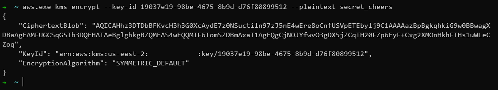
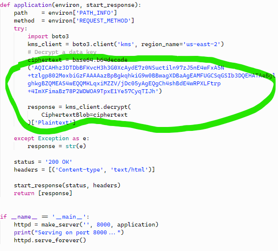
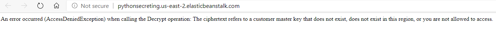
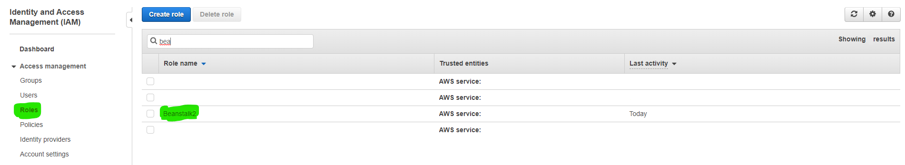
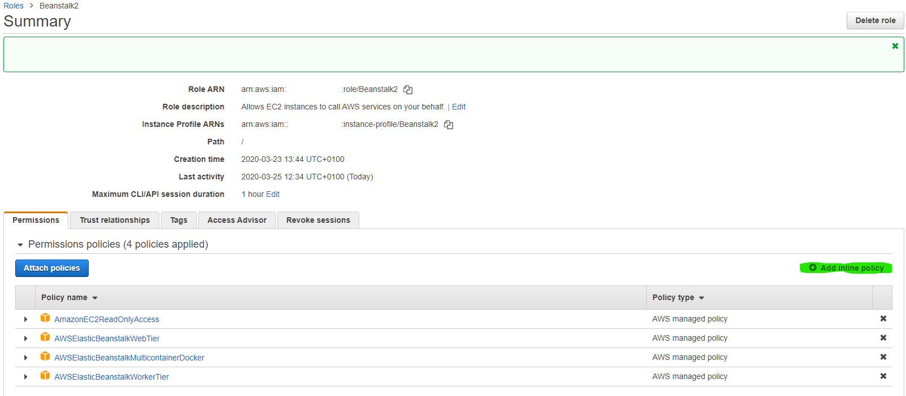
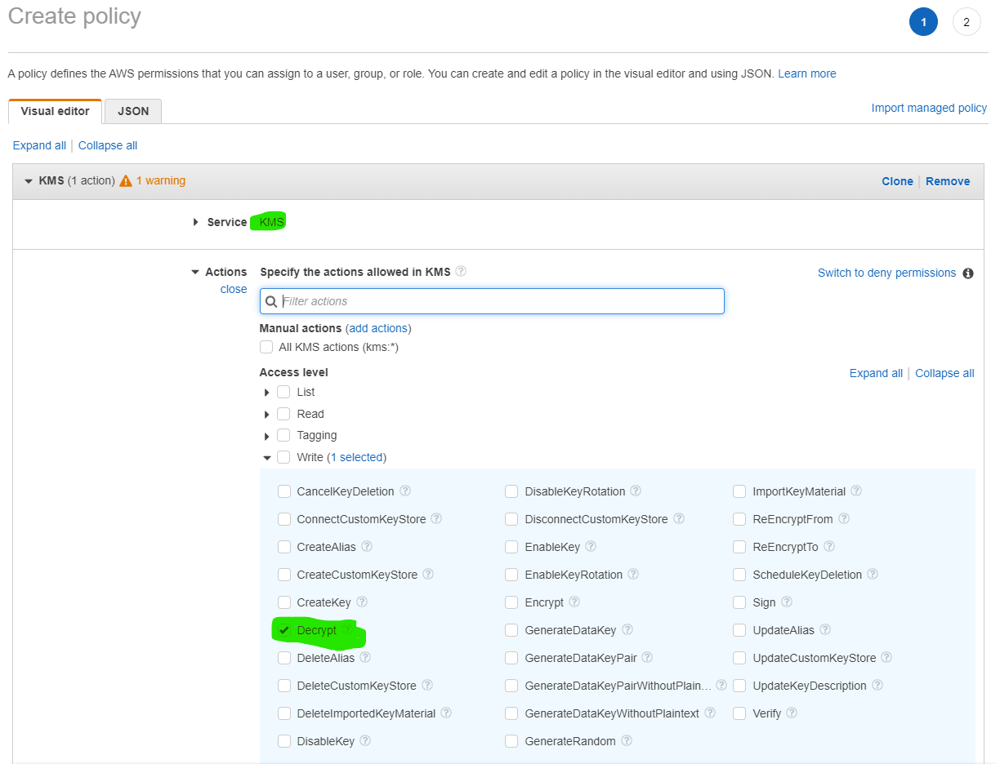
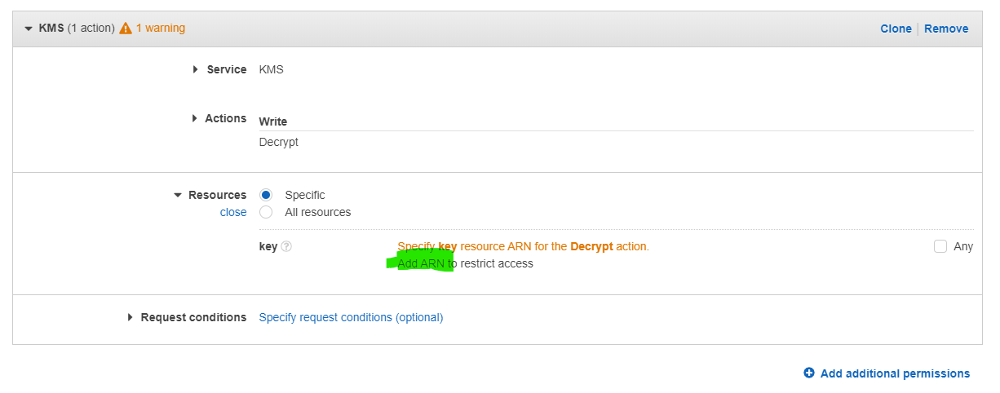
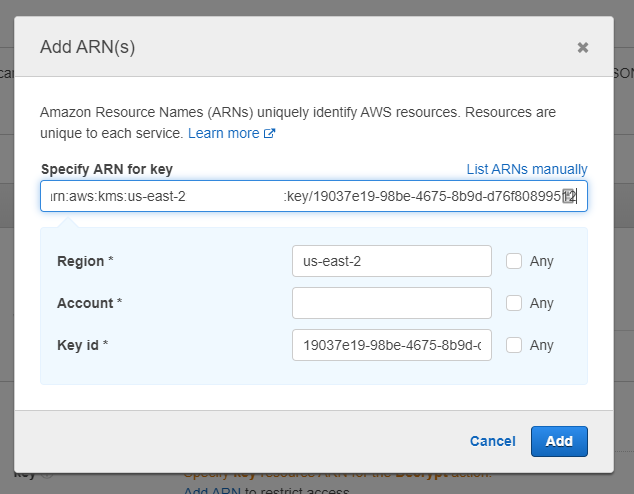
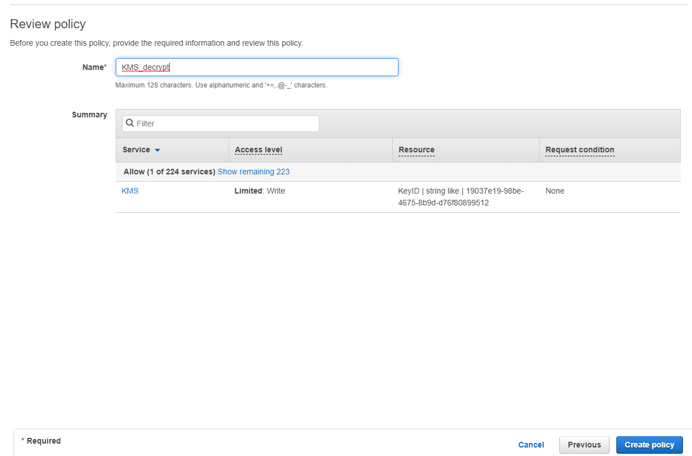
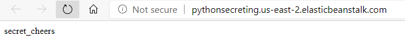

# Using AWS KMS in various AWS services (Beanstalk, EC2, lambda) in various languages/frameworks

## Create a Customer Managed Key in KMS (next-next-finish, aside the alias, leave everything on default)


## Generate a secret with AWS CLI, using this newly created key
## If you CLI's role does not have access to the key by default (does not have Admin access policy), do the same as with the application's policy and add explicit access to it (follow steps below).
## You should type and see something like this:
```sh
aws.exe kms encrypt --key-id KEYID --plaintext STUFF_TO_ENCRYPT
```


## If you try to use the key in an application now to decrypt something, it will fail - we need to allow the apps to use the key explicitly.



## Navigate to the policy setting of the application's role (in our example, the application uses the role `Beanstalk2`)

## Edit the policy settings for the role, by adding an inline policy


## Select KMS as the service and add Write/Decrypt action

## Specify the ARN of the newly created key from KMS


## Review, name and create the policy


## After a few seconds, trying to use the key again will yield a success

