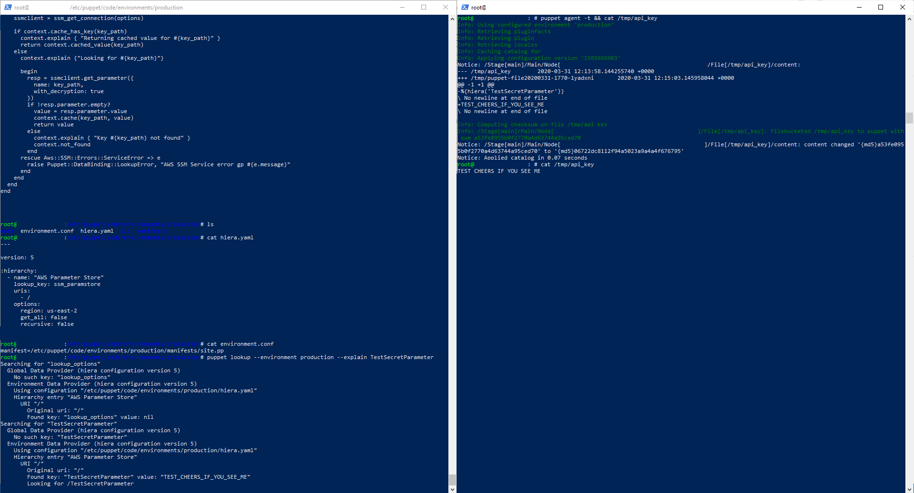

# Puppet stuff in EC2 without putting the plaintext secrets in GIT

## This solution works if the puppet master and clients are running on AWS EC2 instances, and have hiera configured. See the repo files for the configs.
### Note: The guide assumes You have at least beginner knowledge of AWS, Puppet and Hiera.

## Follow common steps on the setup of a role. Add the role to the puppet master EC2 instance.
## An example run of the setup if everything done correctly
