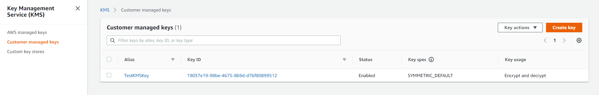
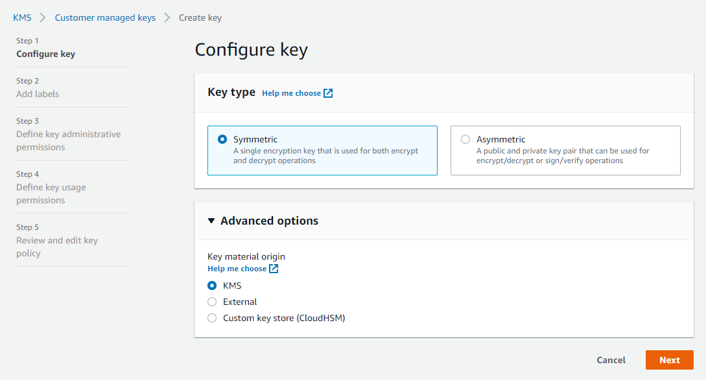
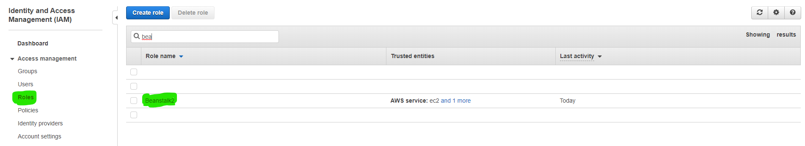
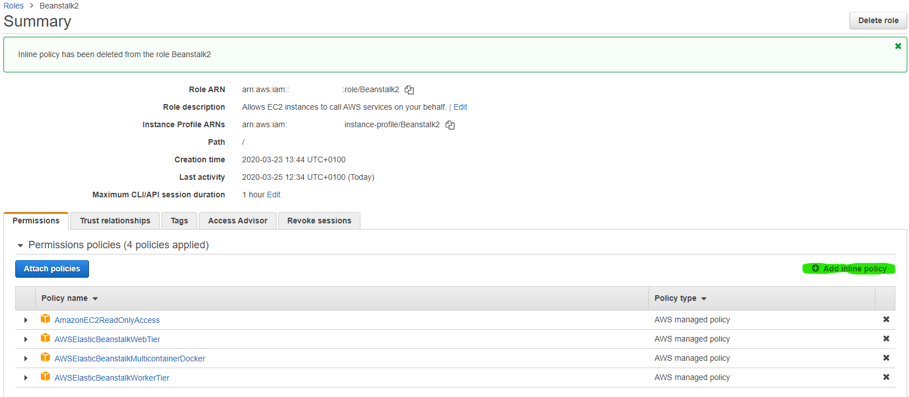
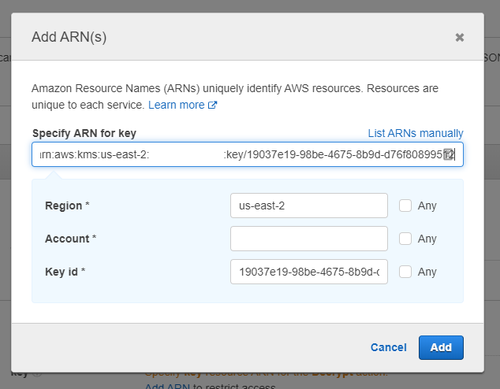
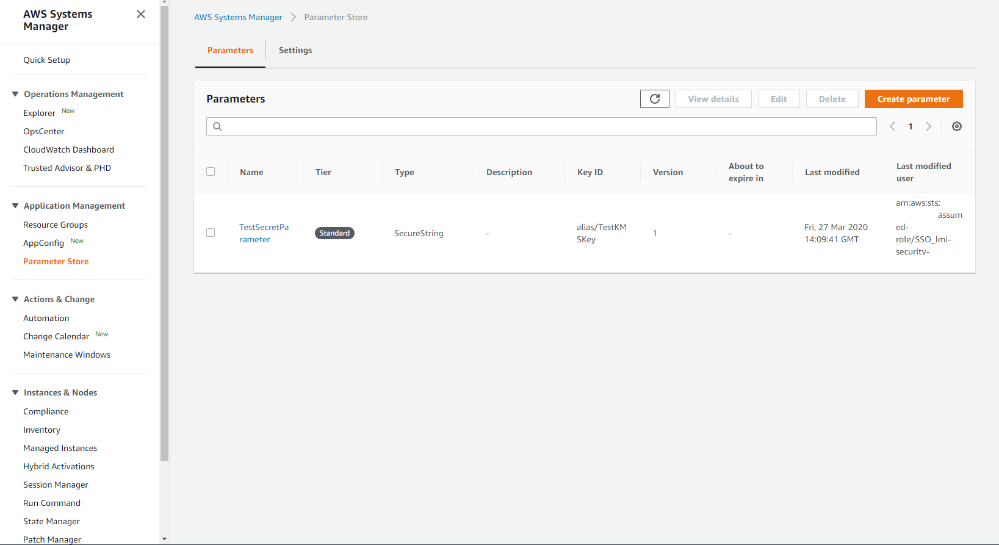
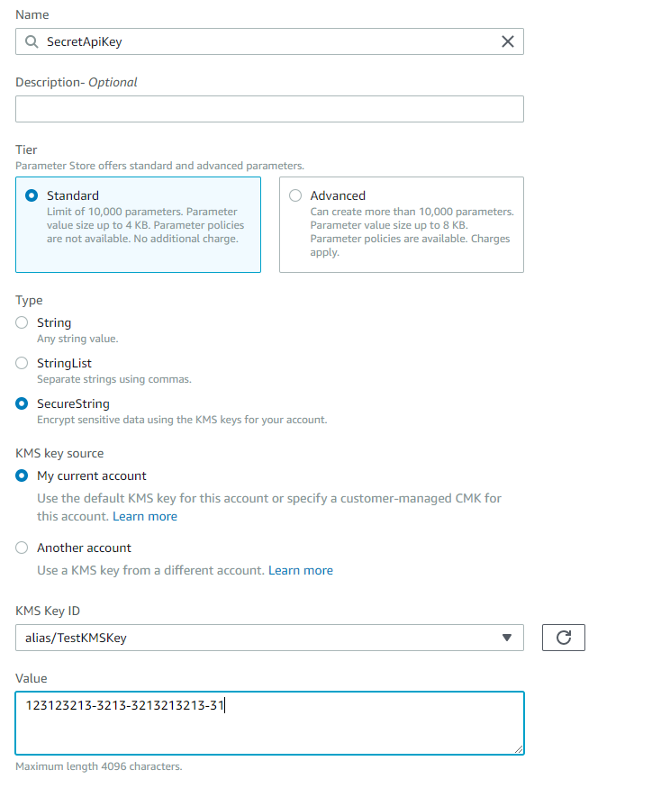
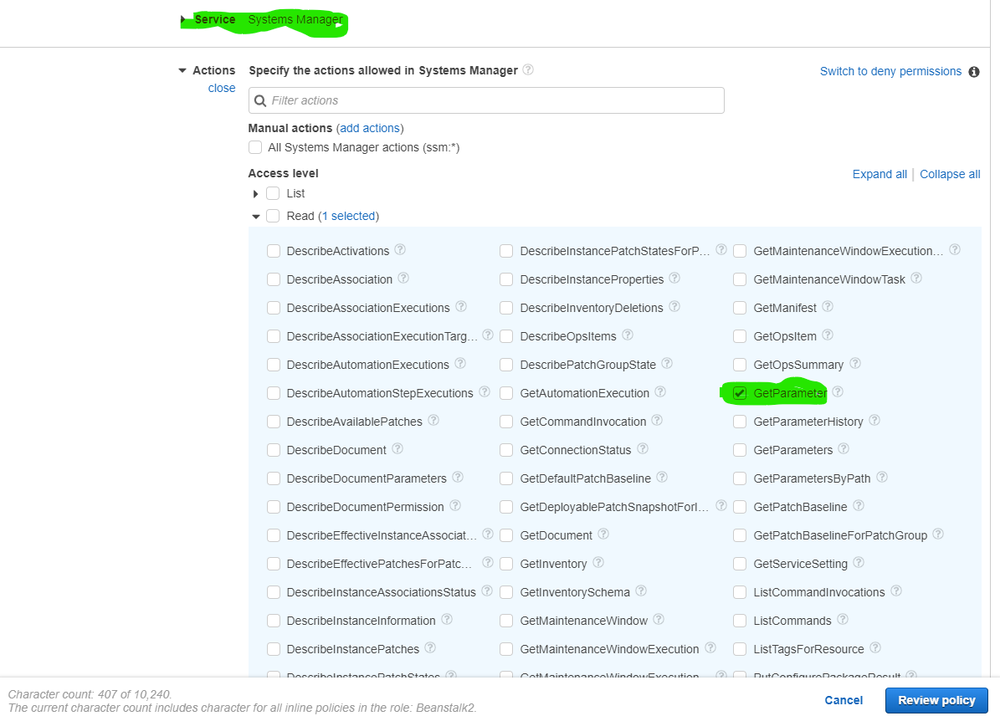
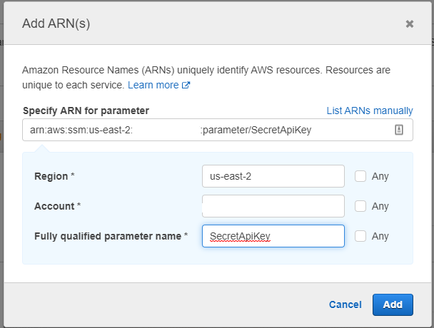

# Using AWS SSM Parameter Store in various AWS services (Beanstalk, EC2, lambda) in various languages/frameworks

## To utilize encrypted parameters, first we need to create a Key that will be used for encryption.
## Create a Customer Managed Key in KMS (next-next-finish, aside the alias, leave everything on default)

## Navigate to the policy setting of the application's role (in our example, the application uses the role `Beanstalk2`)

## Edit the policy settings for the role, by adding an inline policy

## Select KMS as the service and add Write/Decrypt action

## Specify the ARN of the newly created key from KMS

## Review, name and create the policy

## Now we can use this key when creating parameters.
## In Systems Manager/Parameter Store create a new parameter.

## User Secure String and choose the newly created KMS key for encryption.

## Finish the creation by clicking `Create parameter`
## Navigate to the app policy settings again and create a new inline policy.
## As Service, select Systems Manager and in action choose Read/GetParameter

## Specify the resource

## Review and create the policy.

## Your application now can use the parameter. For examples, see the projects in the directory.
