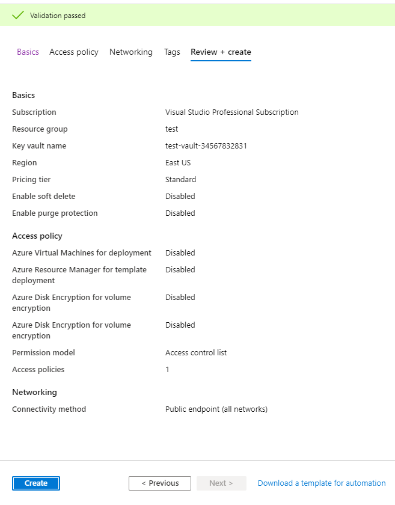
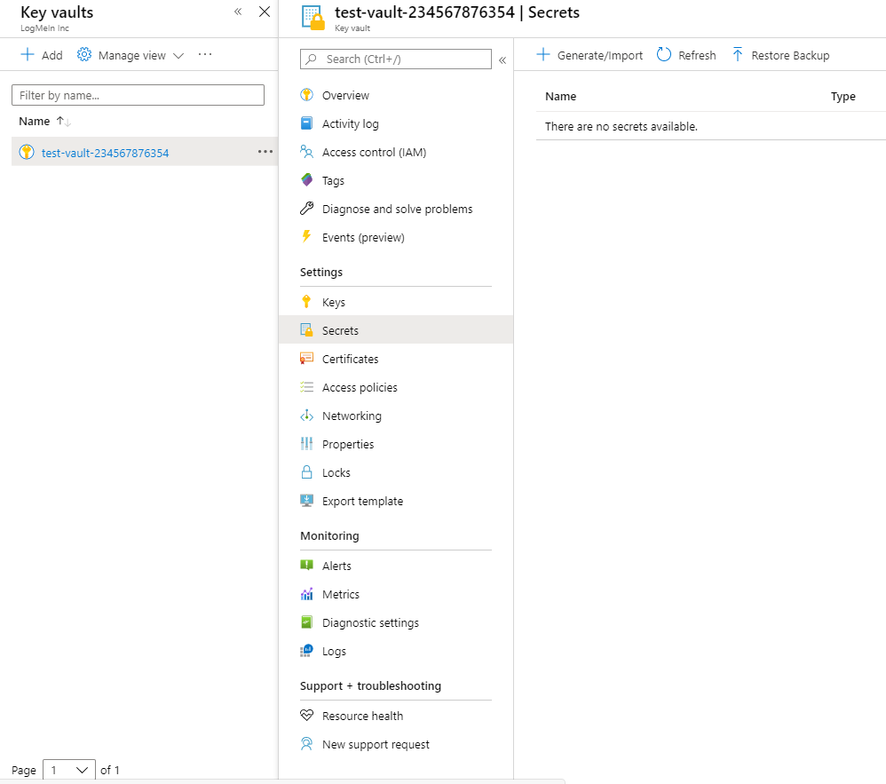
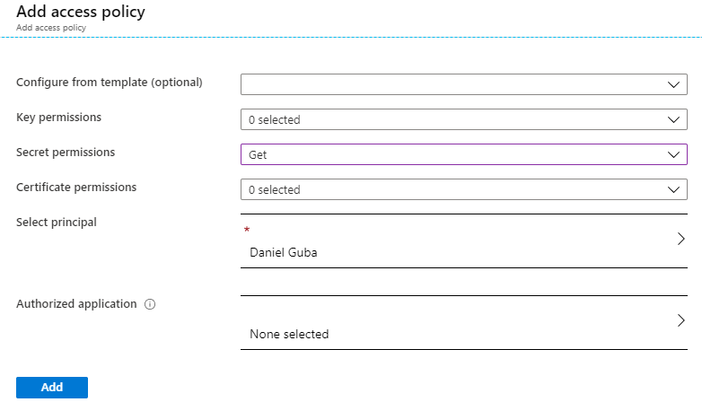

# Using Azure keyvault

## Create a new keyvault:


## Name it, specify resource group, region, etc. then clink `Review + create`



## Create a secret



## On the Key vault, create a new `Access policy`


## If You plan to develop locally, specify `Get` permission for your account. If this is an on-premise app, You will need an app registration created and its client ID and client secret and specify access for the app registration.


## Save the new policy


## Your apps now can use the secret in the vault, on PC's you are logged in with your Azure AD credentials. If this is not the case, use Visual Studio (Code) to log-in to Azure with an extension (https://docs.microsoft.com/en-us/python/api/azure-identity/azure.identity.defaultazurecredential?view=azure-python - On Windows only: a user who has signed in with a Microsoft application, such as Visual Studio. If multiple identities are in the cache, then the value of the environment variable AZURE_USERNAME is used to select which identity to use. See SharedTokenCacheCredential for more details.).
## In the case of on premise applications, specify the app registrations client id and secret and also the tenant id in environment variables:
```
AZURE_TENANT_ID: ID of the service principal's tenant. Also called its 'directory' ID.
AZURE_CLIENT_ID: the service principal's client ID
AZURE_CLIENT_SECRET: one of the service principal's client secrets
```