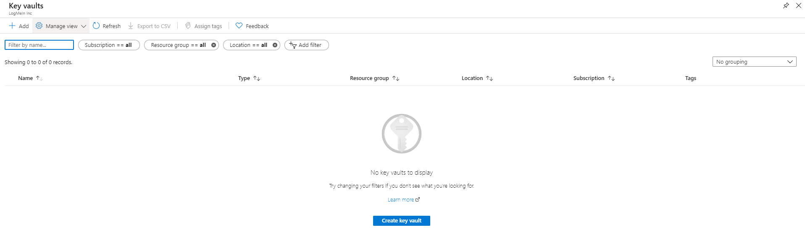
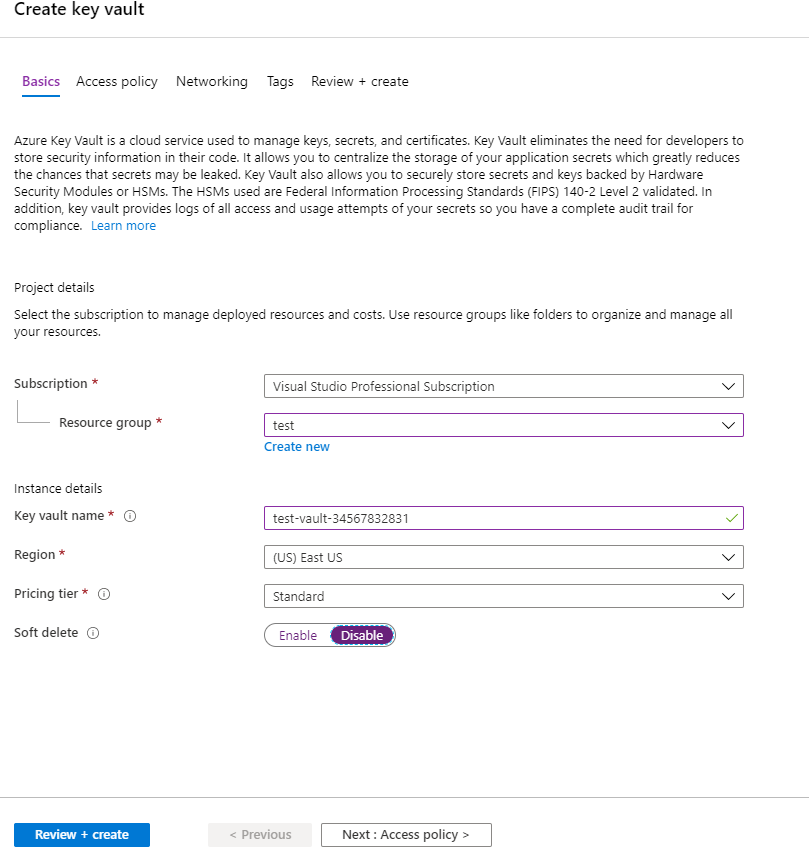
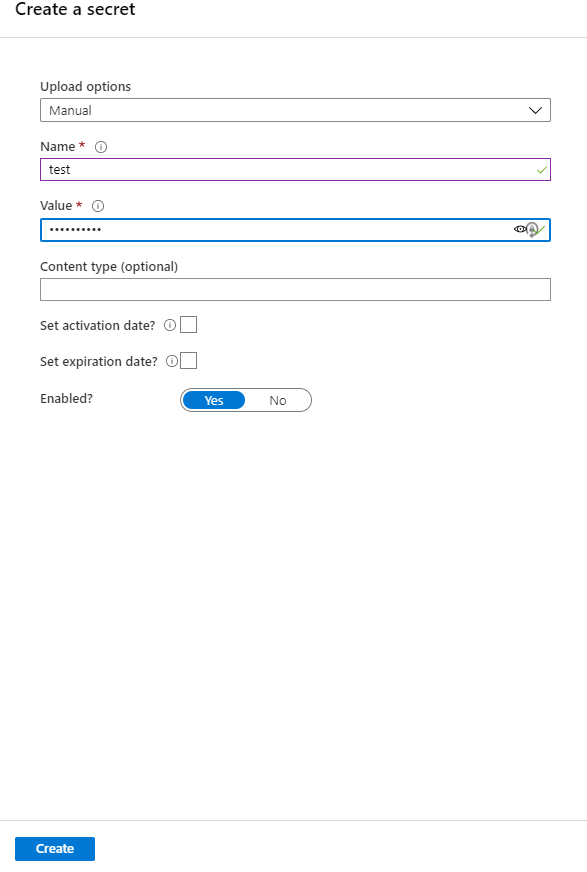
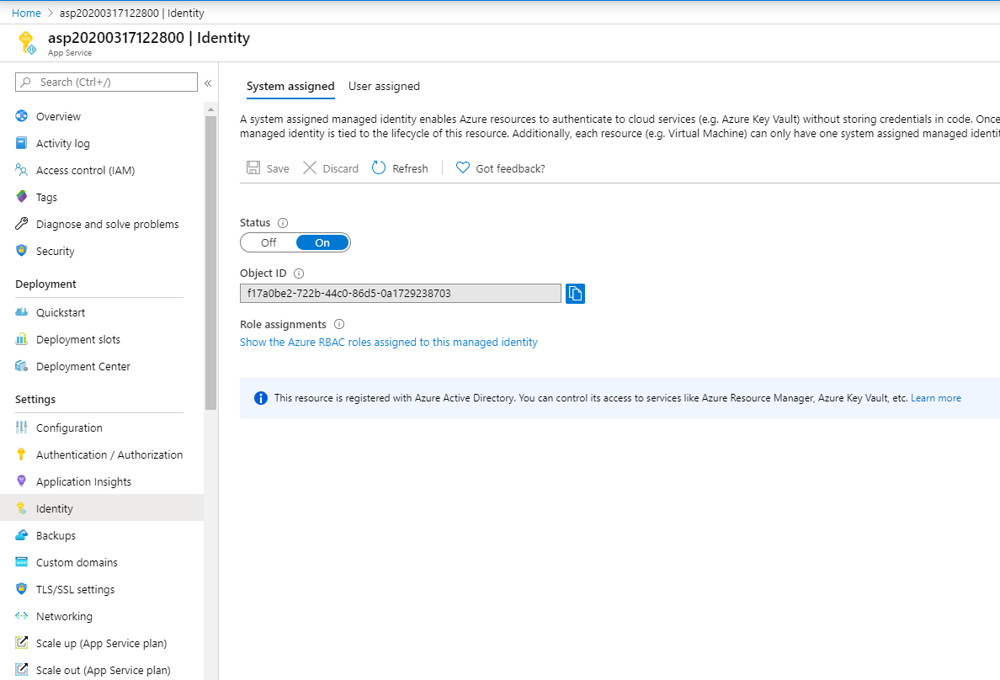
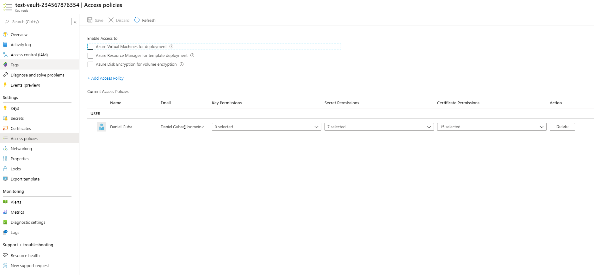
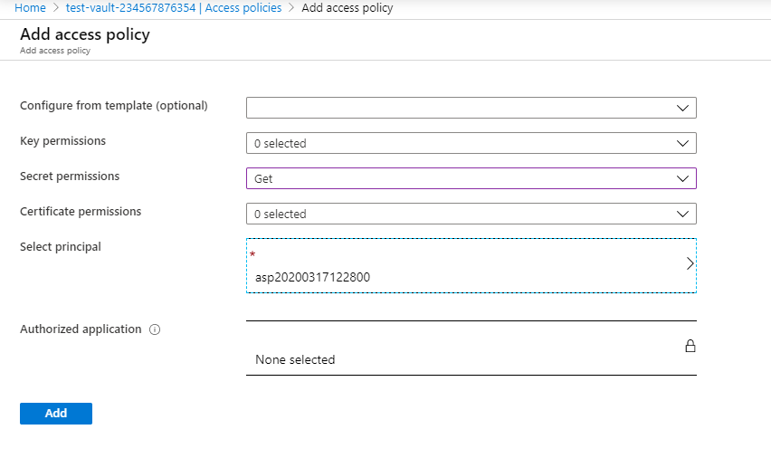
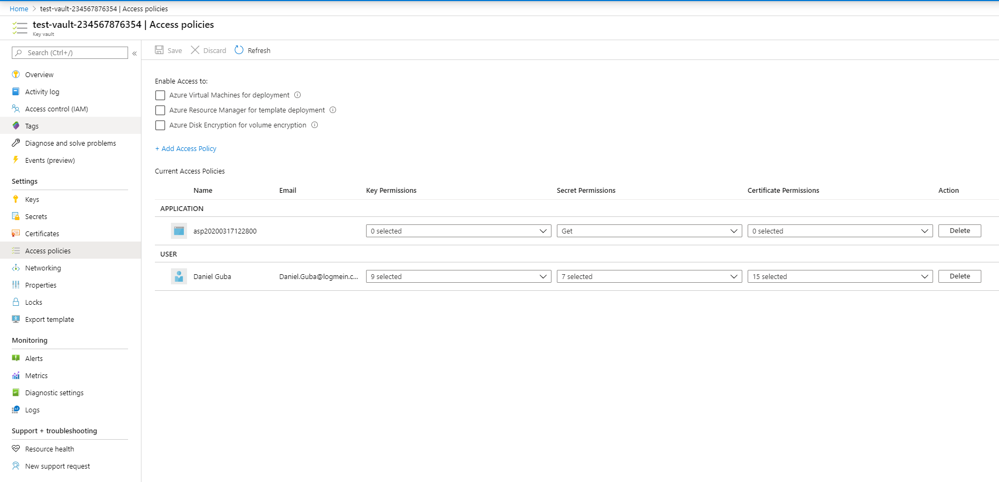

# Using Azure keyvault

## Create a new keyvault:

## Name it, specify resource group, region, etc. then clink `Review + create`

## Create a secret

## On your app service/anything you want to use this secret, turn on `System managed identity`

## On the Key vault, create a new `Access policy`

## Specify `Get` permission for the principal of your choice

## Save the new policy

## Your app now can use the secret in the vault - for an example, see the `azure-hosted-dotnetcore` project.