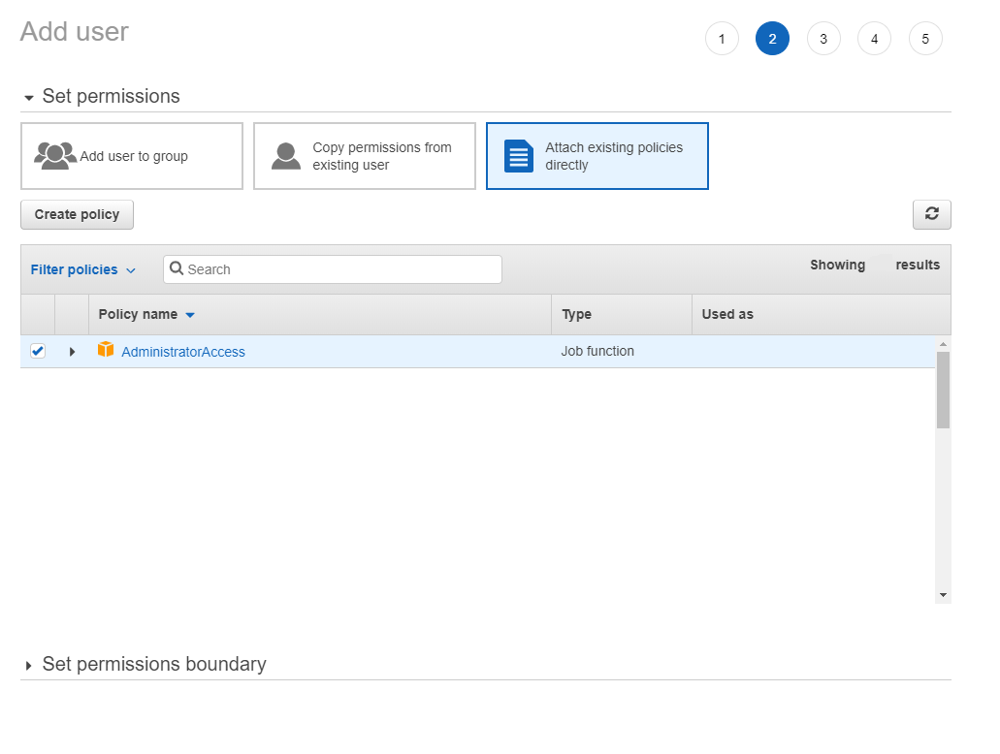

# Using Credstash

## Create a Customer Managed Key in Amazon KMS and name it (alias) `credstash` (next-next-finish, aside the alias, leave everything on default)


## Create a new user for the application (on premise app) or one for your machine (for local development). You will run it locally, of course, but to set up policies, we need one.
## Enable programmatic access.

## Edit the policy settings for the role, by inline policies. See the AWSKMS common guide in the other folder about the specifics for on premise applications.
## Alternatively add Administrator access, if You are setting up a local development environment - this is a lazy solution


## Next-next-finish the user creation.
## After the `Create user` button, a screen will come up with the access key. This is showing only now, and only now.

## Copy the values in the following format into a file:
### - `~/.aws/credentials` on Linux, macOS, or Unix
### - `C:\Users\USERNAME\.aws\credentials` on Windows
```
[default]
aws_access_key_id = your_access_key_id
aws_secret_access_key = your_secret_access_key
```

## Now install the `credstash` pip module and set it up.
```
python -m pip install credstash
python -m credstash setup
```
## Now you are able to put and get secrets.
```
PS C:\Users\user> python -m credstash -r us-east-2 put foo bar
foo has been stored
PS C:\Users\user> python -m credstash -r us-east-2 get foo
bar
```

## Also, now you are able to use the credstash from code - see the language specific projects for examples.