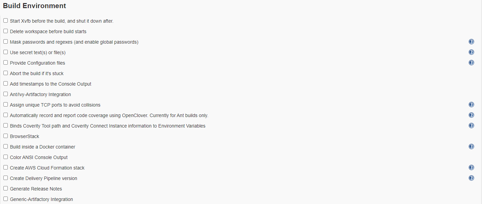
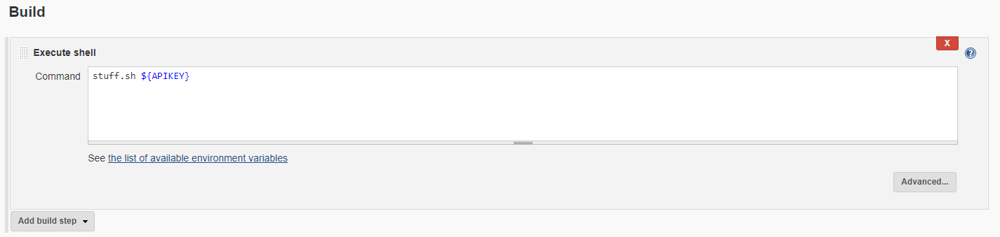

# Setting up a 'secret' parameter in Jenkins build configurations

## In a build configuration, at `Build environment` select `Mask passwords and regexes`

## A new section will show up where You can specify passwords
## After selecting the appropiate `Kind` click `Edit...` next to `Spec`.
## Click `Add` to make one - Name it then type the `Password`.

## You can reference them in Build steps the following way:
