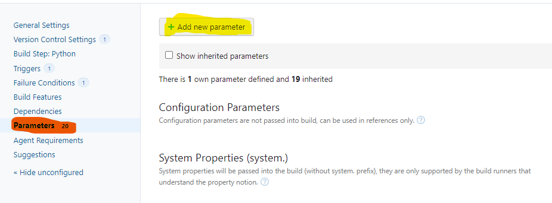
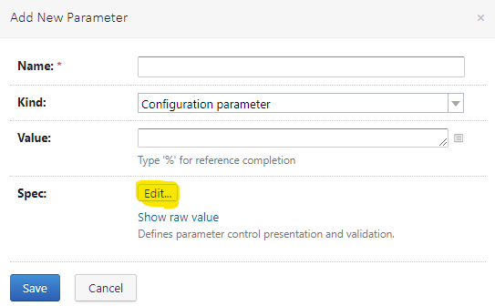
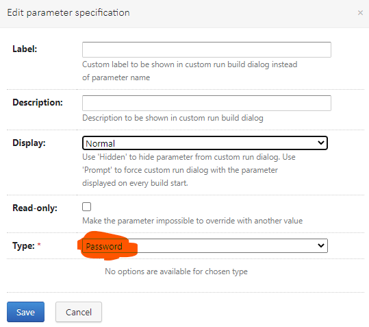
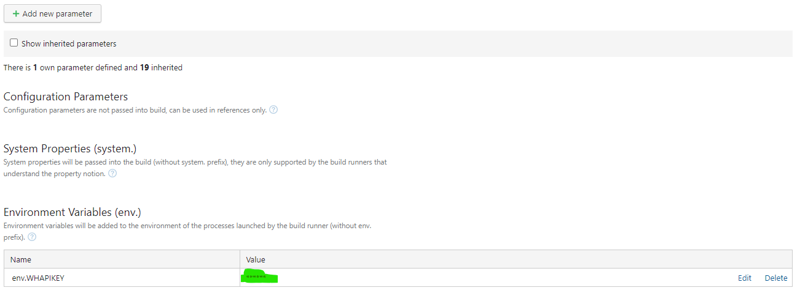

# Setting up a 'secret' parameter in TeamCity build configurations

## Select `Parameters` from the Build configuration editor and click `Add new parameter`



## Name your variable, type/paste it's `Value` and select a `Kind`:
* ### Select `Configuration parameter` if only the build scripts need the parameter.
* ### Select `Environment variable` if the parameter needs to be accessible in something the build script/step starts, and is not passed as a parameter to it.

## After selecting the appropiate `Kind` click `Edit...` next to `Spec`.


## Select `Password` as `Type`


## Click `Save` on both of the open editors

## In the listing, now You can see the secret variable, with it's display hidden.


## Although it's possible to get this value in an "uncensored" form, at least Reader of projects cannot grab it.
## Using the parameter is the same as the others. Put it between `%` signs in the build script/step.
## In this case:
```
%env.WHAPIKEY%
```