# Hashicorp vault set-up and putting in some secrets, protected by a policy

## Download the vault binary from Hashicorp website (the tutorial works with the free/opensource one)
## To ease getting started, find a selfsigned cert+key and a config file in the vault_files directory. Copy these next to the binary. In production environments ask Your IT staff to provide you a correctly signed TLS cert. Or at least use your own self signed cert, not these.
## Start the vault with:
`./vault.exe server -config config.hcl`

## Open the vault in the browser at https://127.0.0.1:8200
## Initialize with some good parameters. AFAIK 5-3 is a good one.
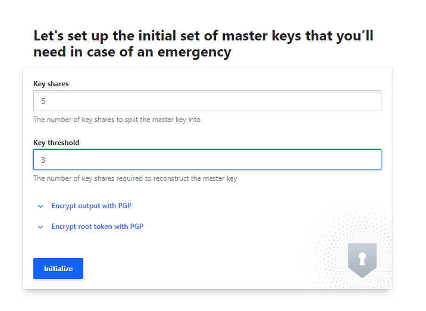
# DOWNLOAD THE KEYS. THIS IS YOUR ONLY CHANCE.
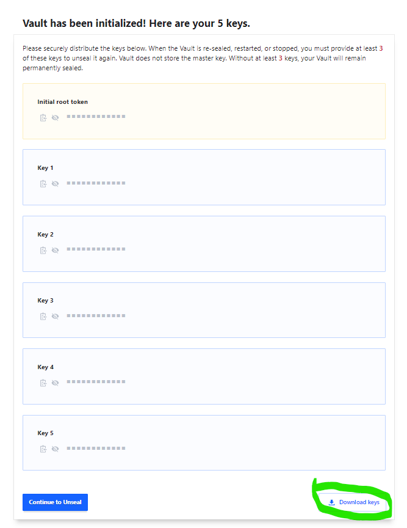
## Put the file contents into a secure place. I recommend LastPass Secure Note.

## Click `Continue to unseal` after downloading the keys.
## Copy and paste parts from the downloaded keys and Unseal the vault.
## Log in to the vault with the root token (also in the downloaded keys file)
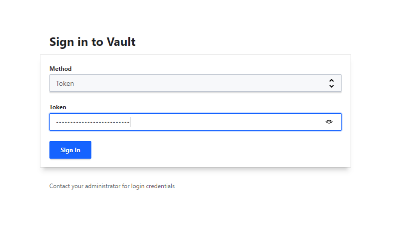
## Create a new secrets engine
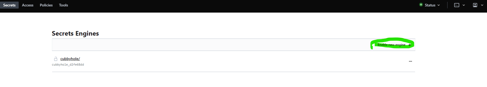
## In the example we will use KV, for its simplicity
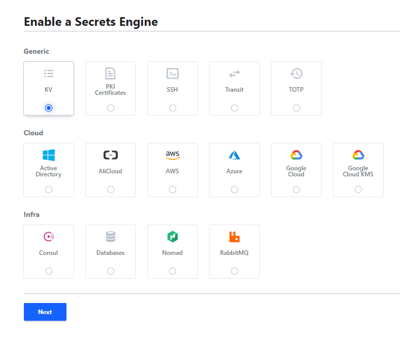
## Name it, then `Enable engine` it.
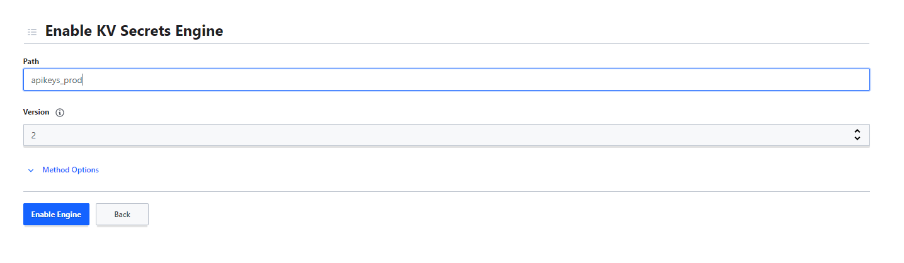
## Create a new secret
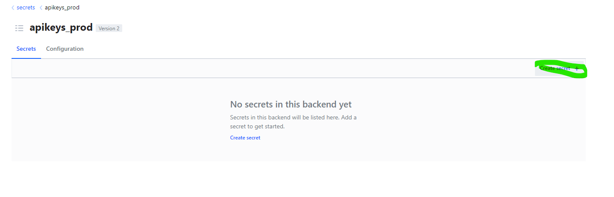
## Name it something and fill it with your secret values (at foobar add your api keys with not so placeholder values - or use foobar and the names i used to work with the example projects/testing the setup)
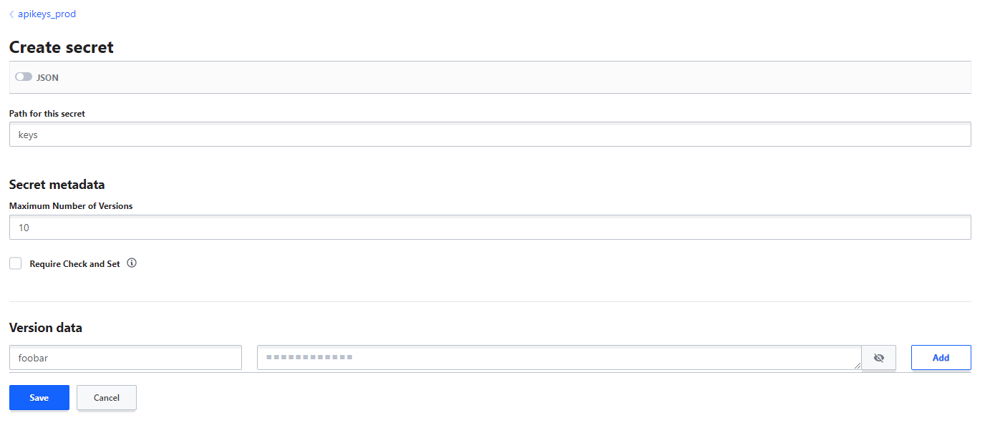
## Navigate to Policies and create one. I recommend a policy for each use case/application
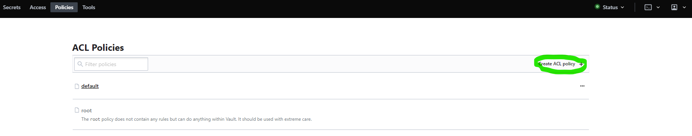
> To work with the example projects, use this:
```
path "apikeys_prod/data/keys" {
  capabilities = ["list", "read"]
}
```
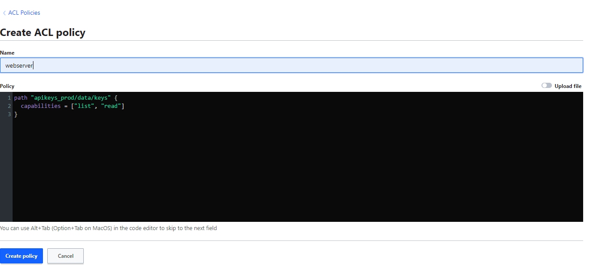
## Open up a terminal, and create a token (use TLS skip only in local development setups where you use a self signed certs).
`./vault.exe login -tls-skip-verify ROOT_TOKEN`  
`./vault.exe token create -policy=webserver -tls-skip-verify`
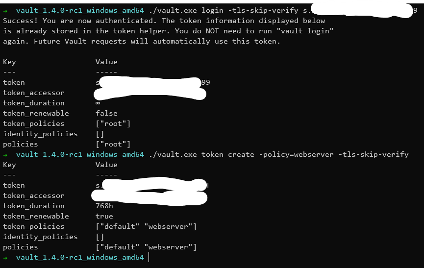

## Put the token from the second commands output to an environment variable called VAULT_TOKEN on the application server. If you developing locally, and while I don't recommend this, you can put the root token into the ENV var too - this way it might be easier to develop but harder to debug in case of some policy error with permission denies.


