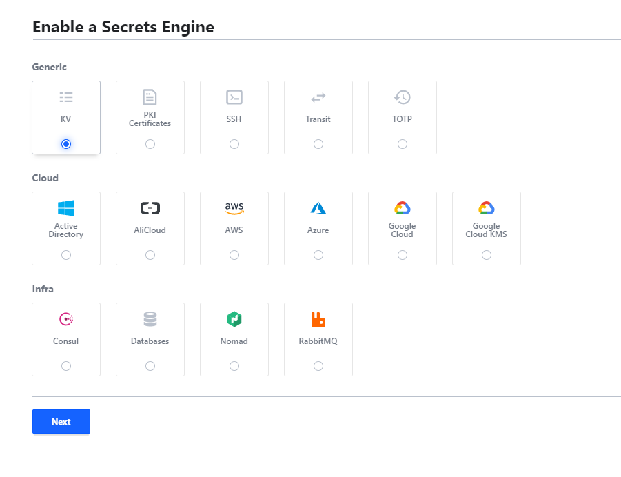
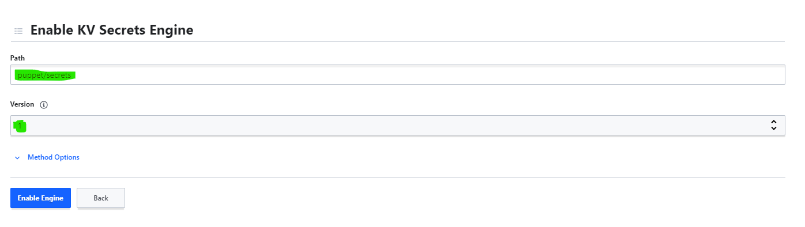
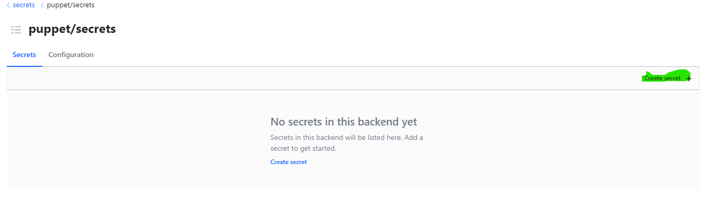
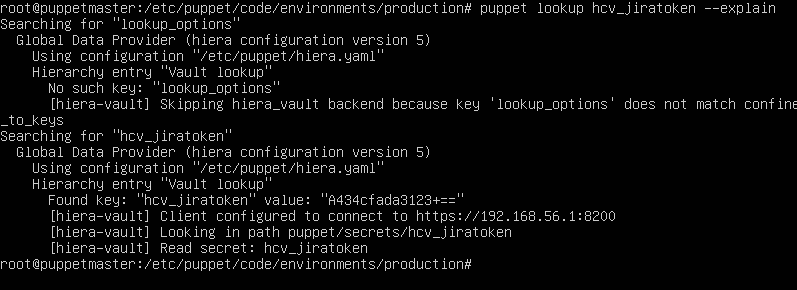
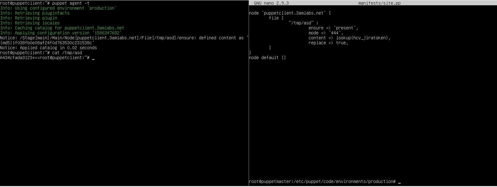

# Using Hashicorp Vault with Puppet

## Follow the steps described in 'common' and then, get ready for setting up some new secrets.
## For some unknown reason (maybe it's a version thing), working with HCV in Puppet is a bit tricky sometimes.
## First, install the following gem on the puppet master:
`gem install vault`
## And then the puppet module:
`puppet module install petems/hiera_vault`
## The configuration is something like the following (hiera.yaml):
```yaml
---

version: 5

hierarchy:
  - name: "Hiera-vault lookup"
    lookup_key: hiera_vault
    options:
      confine_to_keys:
        - 'hcv_.*' # use this backend only for keys starting with...
      ssl_verify: false # for self signed certs only! please use good certs in prod
      address: https://192.168.56.1:8200
      token: <insert-your-vault-token-here> # or you can use the VAULT_TOKEN env. variable
      default_field: value
      mounts:
        puppet: # this will be reflected in the secret creation
          - secrets # this too
```

## To make this guide simple, use the token created in 'common' steps and go to the previously defined policy, and edit to look like this (notice the values in the path vs. the config):
```
path "puppet/secrets/*" {
  capabilities = ["list", "read"]
}
```
## Now create secrets to use, using the KV engine


## Use version 1! The path should reflect the one in the config.

## Create a new secret in the engine

## Use the prefix defined in `confine_to_keys` and the value of `default_field` for the key part of the secret (in our case: value).


## Now You can look up the secret from puppet:
`puppet lookup hcv_jiratoken --explain`


## Or in a manifest

